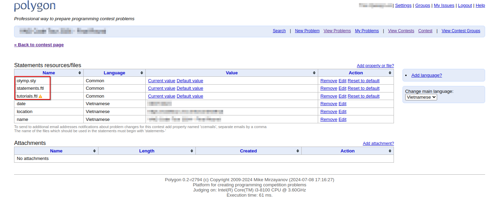

# Vietnamese support for PDF statement on [polygon.codeforces][polygon]

These repository contains a fork of [olymp.sty] with support for Vietnamese,
and related template files for generating the Vietnamese statement when
preparing problems on [polygon].

## Using the olymp.sty file

The `olymp.sty` file can be used individually, as shown in the examples in the
original repository [olymp.sty], but remember to replace original file with the
[modified one](./olymp.sty).

The other files in this repository, such as `problem.tex`, can also be used as
reference. They are written as a mixed of LaTeX and [freemarker] (the same
language used in script for test generation on [polygon]). To use those files,
please remove all the [freemarker] code first.

## Generate Vietnamese PDF files on [polygon]

### Generate PDF files for individual problem

For individual problem, navigate to `Files`, and replace the following files
with the ones in this repository:

- `olymp.sty`
- `problem.tex`
- `statements.ftl`

To see the PDF files (statement and tutorial), navigate to `Statement`, choose
`Vietnamese` language, and then click `In PDF`/`Tutorial in PDF` to see the
coressponding generated PDF files.

Note that the file `tutorial.tex` does not need to be changed, because it is
minimal.

### Generate PDF files for one contest

In the contest page, navigate to `Properties/Files`.

Here, replace the following files with the ones in this repository:

- `olymp.sty`
- `statements.ftl`
- `tutorials.ftl`

To see the PDF files (statement and tutorial), navigate to `Statement`, navigate
back to the contest page, and choose `Preview Statements as PDF`/`Preview
Tutorials as PDF` with `Vietnamese` option to see the coressponding generated
PDF files.

[polygon]: polygon.codeforces.com
[olymp.sty]: https://github.com/GassaFM/olymp.sty/tree/master
[freemarker]: https://freemarker.apache.org/index.html
